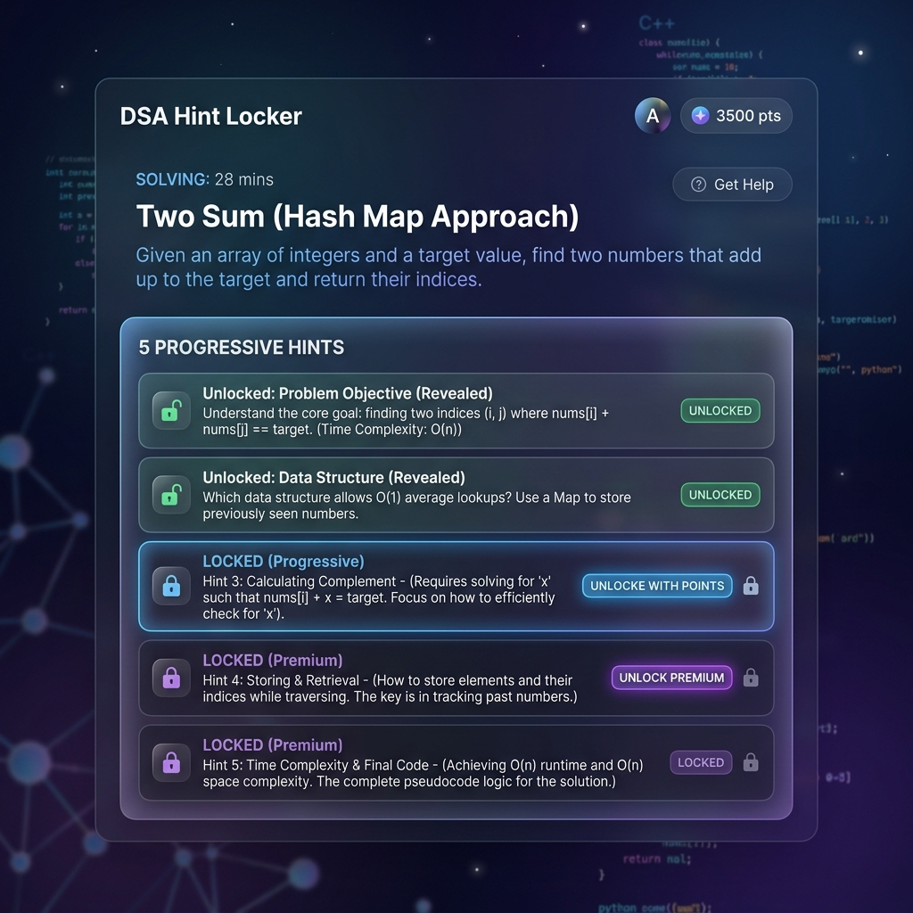
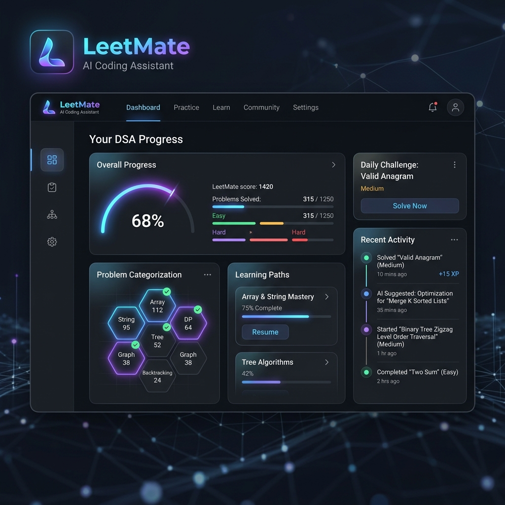
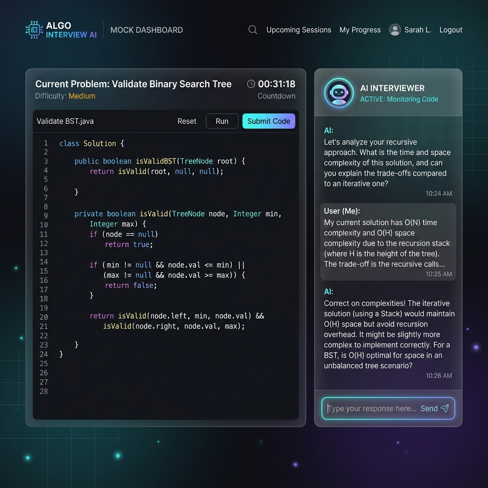
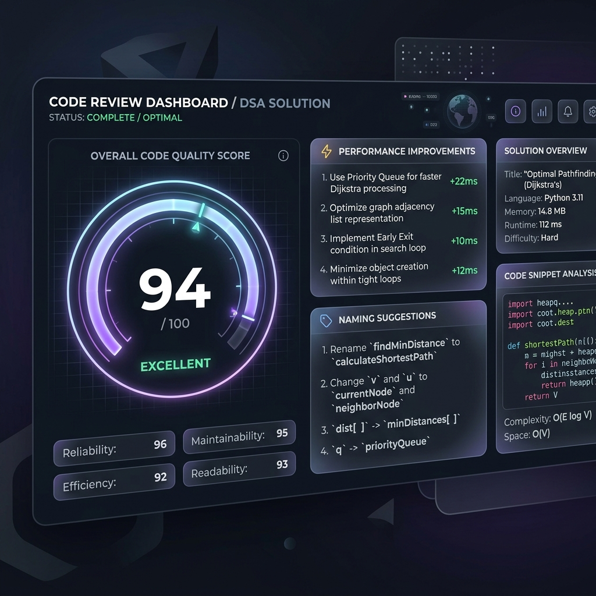
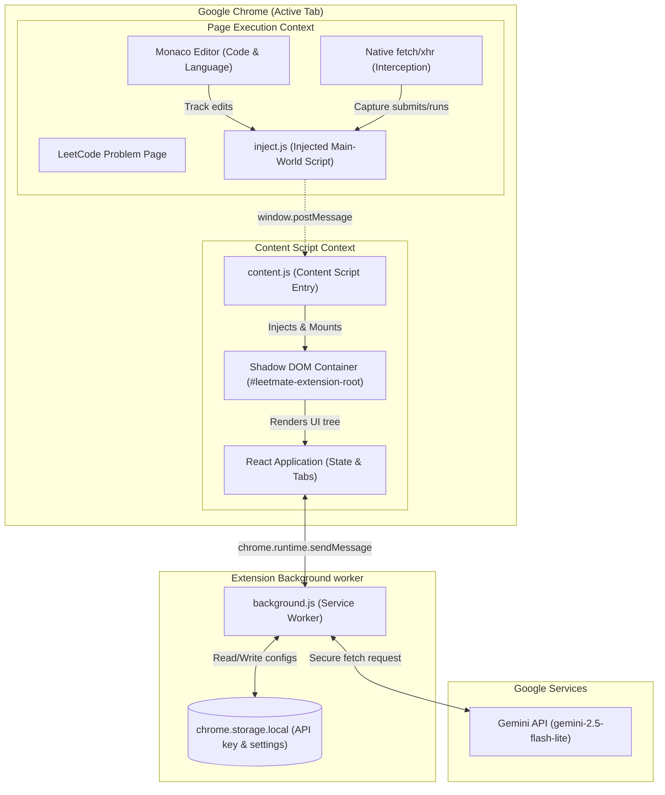

#  LeetMate

> **Cursor for LeetCode** — A premium, AI-powered coding companion and interview prep mentor built directly into LeetCode. 

[](#)
[](#)
[](#)
[](#)
[](#)

---

## Project Preview

### Main Dashboard


### AI Assistant


### Hint Mode


### Code Review


### Interview Mode


---

## Introduction

**LeetMate** is a production-grade, premium Chrome Extension designed to serve as an intelligent, context-aware coding companion for developers. Instead of acting as a simple code generator that robs you of learning, LeetMate behaves like an experienced tech lead or interview coach, guiding you through problem comprehension, logic formulation, code refactoring, and automated debugging right inside the LeetCode platform.

### Why LeetMate Exists
In competitive programming and technical interviews, copy-pasting code from solvers or standard LLM chats creates dependency and hinders learning. LeetMate bridges this gap by injecting a resizable, glassmorphic workspace (isolated cleanly via Shadow DOM) into the LeetCode tab. It parses problem statements, tracks active code changes, intercepts runtime executions, and offers step-by-step conceptual walkthroughs.

### Target Audience
* **Students**: Build structural intuition for data structures and algorithms (DSA).
* **Interview Candidates**: Simulating real mock technical interviews with timed, hints-only guides.
* **Competitive Programmers**: Rapidly analyze suboptimal complexity bounds and debug tricky corner cases.
* **Software Engineers**: Review coding style, modularity, and runtime performance inside the editor.

---

## Key Features

* **AI Problem Analysis**: Instantly break down complex problem statements, extract hidden constraints, and identify edge cases.
* **Progressive Hints**: Unlock hints sequentially (Nudge, Logical Direction, DS Tip, Algorithm, Near-Solution) to solve issues independently.
* **Interactive Tutor**: Chat with a problem-aware tutor that understands your code, active language, and errors.
* **Solution Generation**: Generate high-performance Brute Force, Better, and Optimal solutions that fit the exact editor function templates.
* **Complexity Analysis**: Calculate exact time and space complexity using Big-O notation, accompanied by formal proof.
* **Code Review**: Get static analysis reports scoring your code out of 100 on readability, performance, naming, and best practices.
* **Interview Mode**: Simulates real interviewer behavior by asking clarifying questions and checking trade-offs rather than providing code.
* **AI Debugger**: Automatically intercepts LeetCode compilation errors, wrong testcases, or TLE events to provide visual explanations and fixes.
* **Pattern Detection**: Identify standard pattern templates (e.g., Two Pointer, Sliding Window, Monotonic Stack) utilized in the problem.
* **Revision Notes**: Automatically distill concepts into markdown sheets for offline review before major tech evaluations.
* **Smart Test Cases**: Propose custom inputs designed to break edge cases, overflow bounds, or invalid bounds.
* **Progress Tracking**: Keep stats on unlocked hints, solved categories, and active DSA roadmap metrics.
* **Personalized Roadmaps**: Dynamically curated DSA learning roadmaps mapping out specific LeetCode questions to master weak categories.

---

## Why LeetMate

| Feature / Aspect | LeetMate | Traditional Solving | Generic AI Tools |
| :--- | :--- | :--- | :--- |
| **Workspace Integration** | **Directly embedded in Shadow DOM** | None (Split screen) | External Chat (Manual Copy-Paste) |
| **Pedagogical Focus** | **Progressive hinting & Tutoring** | Staring at Solutions / Editor | Instant spoilers (no learning) |
| **Language Context** | **Auto-detects from Monaco Editor** | Manual | Manual input |
| **Error Handling** | **Auto-intercepts test execution** | Manual debug | Requires manual error paste |
| **Visual Styling** | **Premium glassmorphic theme** | Platform native | Raw chat interfaces |

---

## How It Works

```
┌─────────────────┐      ┌─────────────────┐      ┌─────────────────┐
│  1. Open        │      │  2. Trigger     │      │  3. Analyze     │
│  LeetCode       ├─────►│  LeetMate       ├─────►│  Problem Context│
│  Problem        │      │  Drawer         │      │  & Monaco Code  │
└─────────────────┘      └─────────────────┘      └────────┬────────┘
                                                           │
                                                           ▼
┌─────────────────┐      ┌─────────────────┐      ┌────────┴────────┐
│  6. Code Review │      │  5. Interactive │      │  4. Get Hints   │
│  & Performance  │◄─────┤  Step-by-Step   │◄─────┤  or Solution    │
│  Scoring        │      │  Debugging      │      │  Breakdowns     │
└─────────────────┘      └─────────────────┘      └─────────────────┘
```

1. **Context Extraction**: The extension injects `inject.js` into the page to extract active problem parameters, chosen programming language, and Monaco editor contents.
2. **Proxy Request**: The content script relays the context and user query securely to the Background Service Worker.
3. **Background Proxy**: The Service Worker loads the stored API key, structures a detailed context system prompt, and calls the Google Gemini API securely.
4. **Isolated Rendering**: The UI formats responses (markdown, code highlighting, tables) inside an isolated Shadow DOM container to prevent conflicts with LeetCode's global styling.

---

## Feature Deep Dive

### Hint System
Unlike tools that immediately output solutions, the Hint System acts as a structural DSA mentor. It provides 5 levels of progressive assistance:
1. **Tiny Nudge**: Relates the problem to daily metaphors or simple examples.
2. **Logical Direction**: Guides logic towards the correct traversal or structure.
3. **Data Structure Tip**: Recommends the specific DS required (e.g., min-heap, deque).
4. **Algorithm Hint**: Explains the logic flow (e.g., Binary Search over answer space).
5. **Near-Complete Solution**: Explains the code pseudocode without writing the code.

### Solution Generator
When requested, the system writes clean, production-grade solutions conforming to standard enterprise design principles. It provides three levels of algorithms:
* **Brute Force**: Highlighting simple, naive nested loops or recursions.
* **Better**: An intermediate optimization utilizing hash tables or extra storage space.
* **Optimal**: The most efficient O(N) or O(log N) approach with minimum auxiliary space.

All code generation formats perfectly inside LeetCode's function template signatures, keeping exact parameters and types.

### Pattern Detector
Extracts standard algorithmic patterns, explaining *why* the template works. It points out underlying structural patterns (e.g., dynamic programming knapsack, sliding window, union-find) and correlates them to similar LeetCode problems you should practice.

### AI Tutor
An interactive terminal that keeps track of chat messages. You can highlight parts of the problem or your current code implementation and ask specific debugging questions, e.g., *"Why does this line index out of bounds for even-sized arrays?"*

---

## Screenshots Section

### Main Dashboard Overview


### Progressive Hint Drawer


### Simulated Mock Interview Mode


### Code Quality Assessment


---

## Tech Stack

| Module | Technologies | Purpose |
| :--- | :--- | :--- |
| **Core Architecture** | React, TypeScript, Vite | Scalable, type-safe development environment |
| **UI Components** | Stitch, TailwindCSS, ShadCN | Modern glassmorphism, responsive elements, and clean typography |
| **State Management** | Zustand | Light state updates and persistent extension parameters |
| **AI Integration** | Gemini API (gemini-2.5-flash-lite) | Rapid, cost-effective reasoning and DSA solutions |
| **Testing** | Playwright, Vitest | End-to-end browser checks and unit testing |
| **Extension Wrapper**| Manifest V3 | Standard extension security guidelines |

---

## Architecture Overview



---

## Installation

### Prerequisites
* **Node.js**: `v18.x` or higher
* **Package Manager**: `npm` or `yarn`

### Step 1: Clone the Repository
```bash
git clone https://github.com/your-username/LeetMate.git
cd LeetMate
```

### Step 2: Install Dependencies
```bash
npm install
```

### Step 3: Compile the Project
Build the background scripts, main-world injection scripts, content scripts, and popups:
```bash
npm run build
```
This command compiles and outputs all files into the self-contained `dist/` directory.

### Step 4: Load Extension in Chrome
1. Open Google Chrome and navigate to `chrome://extensions/`.
2. Turn on the **Developer mode** toggle in the top-right corner.
3. Click **Load unpacked** in the top-left corner.
4. Select the `dist/` folder from the compiled `LeetMate` workspace directory.

---

## Configuration

1. **Retrieve Gemini API Key**: Go to [Google AI Studio](https://aistudio.google.com/) and create a free API key.
2. **Access Extension Setup**: Open any LeetCode problem (e.g. `https://leetcode.com/problems/two-sum/`). A floating LeetMate button will display in the bottom-right corner.
3. **Configure API Key**: Click the button to launch the Onboarding panel, paste your API key, and click **Validate & Continue**.
4. **Adjust Settings**: At any time, select the **Settings** icon inside the SidePanel header to update your API key or export settings backup sheets.

---

## Project Structure

```
src/
├── assets/           # Static asset images and branding logos
├── background/       # Background service worker (API proxies and proxy key stores)
│   └── index.ts      # Service worker entrypoint
├── components/       # Reusable React UI component building blocks
│   ├── FloatingButton.tsx # Drag-and-drop floating launcher
│   ├── SidePanel.tsx # Sliding dashboard drawer
│   ├── Onboarding.tsx# Onboarding layout
│   └── Debugger.tsx  # Run diagnostics component
├── content/          # Content scripts running inside active tab
│   ├── index.tsx     # Shadow DOM mounter and entrypoint
│   ├── inject.ts     # Main-world script injecting Monaco listeners
│   └── polyfill.ts   # Polyfills defining global environment values
├── store/            # State configuration
│   └── useStore.ts   # Zustand store managing workspace active context
└── styles/           # Global directives
    └── index.css     # CSS file loading Tailwind CSS modules
```

* **`src/background/`**: Manages background proxy API calls to Gemini. Keeps your API key isolated from the page script environments.
* **`src/content/`**: Runs inside the LeetCode tab. `inject.ts` hooks into Monaco, while `index.tsx` hosts the Tailwind-isolated Shadow DOM components.
* **`src/components/`**: Modular UI dashboard tabs (tutor, hint lockers, code reviewer, and settings panels).

---

## Security

* **API Key Isolation**: Stored within the secure `chrome.storage.local` sandbox. All LLM query calls are routed through the extension's isolated Background Service Worker. Your key is never exposed to LeetCode's main page scripts.
* **Styling Sandbox**: React mounts inside a custom `#leetmate-extension-root` Shadow DOM container. All Tailwind CSS v4 directives are compiled and injected as scoped stylesheets inside the Shadow Root, meaning LeetCode page styling never bleeds into LeetMate, and vice versa.
* **Zero Script Execution on Page**: The main-world injected script (`inject.ts`) strictly listens to Monaco changes and returns parameters. It contains zero eval blocks, satisfying Manifest V3 security rules.

---

## Performance

* **Local Caching**: Resolved solutions and generated progressive hints are cached inside the memory store during the session, reducing API usage and redundant token counts when switching tabs.
* **Monaco Listening Optimization**: Monaco editor code edits are throttled, preventing rapid typing from triggering repetitive rendering or background messages.
* **Lazy Module Bootstrapping**: Heavy sub-tabs (e.g., Code Review, Debugger panels) are dynamically loaded to minimize memory footprint in the background when active panels are closed.
* **Zero Chunk-Splitting Compilation**: Custom bundling scripts bundle scripts as self-contained libraries (IIFE), ensuring fast initialization without script loading delays.

---

## Roadmap

- [x] Resizable glassmorphic Side Panel inside Shadow DOM.
- [x] Progressive hint unlocks (5 logical step levels).
- [x] Dynamic Monaco Code and Active language extraction.
- [x] Interception of LeetCode compiler run outputs.
- [p] Automated saving of history notes as flashcard files.
- [p] Local LLM support via Chrome's experimental Prompt API.
- [ ] Offline practice mode with cached DSA sheets.

---

## FAQ

#### Does LeetMate solve problems automatically?
No. LeetMate is built as an algorithmic mentor, not a cheat tool. While it can generate solution suggestions when prompted, its default behavior (like Hint Mode or Interview Mode) is configured to provide step-by-step logic hints, nudges, and explanations to help you solve problems yourself.

#### Does it support all LeetCode languages?
Yes. LeetMate parses the active editor language and current template. Whether you code in C++, Python, Java, JavaScript, Rust, or Go, all hints and solutions align with your selected environment.

#### Is my API key secure?
Yes. Your API key is saved locally in your browser's private extension storage. It is never transmitted to any third-party server besides direct secure calls to the official Gemini API endpoints.

#### Can I use it during contests?
We strongly recommend turning off the extension during active contests to comply with LeetCode's terms of service and contest rules.

---

## Get Started

Open any LeetCode problem, launch LeetMate, and elevate your algorithmic problem-solving skills to FAANG-readiness today!
